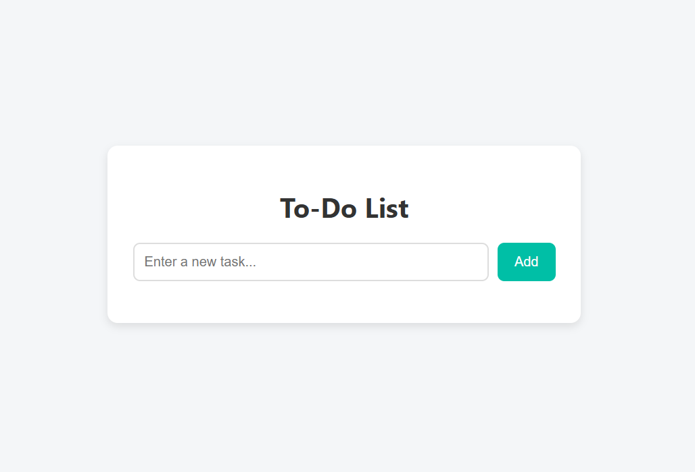
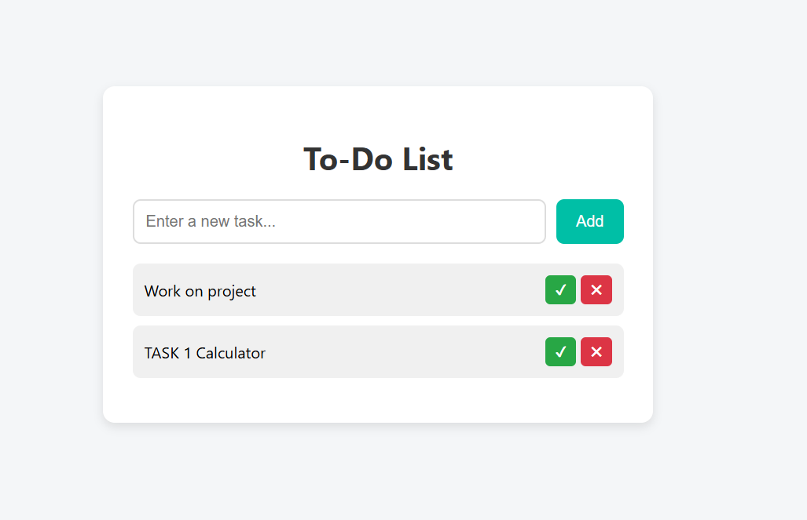

# 📝 To-Do List Web Application

A clean, responsive, and interactive To-Do List web app built using **HTML**, **CSS**, and **JavaScript**. This project allows users to manage tasks efficiently by adding, completing, and deleting items — with persistent storage using `localStorage`.

---

## 🚀 Features

- ✅ Add new tasks with a single input
- ✅ Mark tasks as completed
- ✅ Delete individual tasks
- ✅ Store tasks in browser using `localStorage`
- ✅ Responsive UI with modern design
- ✅ Smooth hover effects and transitions

---

## 💻 Technologies Used

- **HTML5** – Semantic structure of the page
- **CSS3** – Styling, layout, and responsive design
- **JavaScript** – Dynamic interactivity and task management
- **LocalStorage** – To persist data between sessions

---

## 📂 Project Structure
project-folder/
├── index.html # HTML markup
├── style.css # Styling for UI
├── script.js # Logic and interactivity

## 📸 Screenshot

🙌 Acknowledgements
This project was developed as part of a learning module and improved for clean UI and UX demonstration.

Built from scratch using vanilla technologies — no libraries or frameworks.

